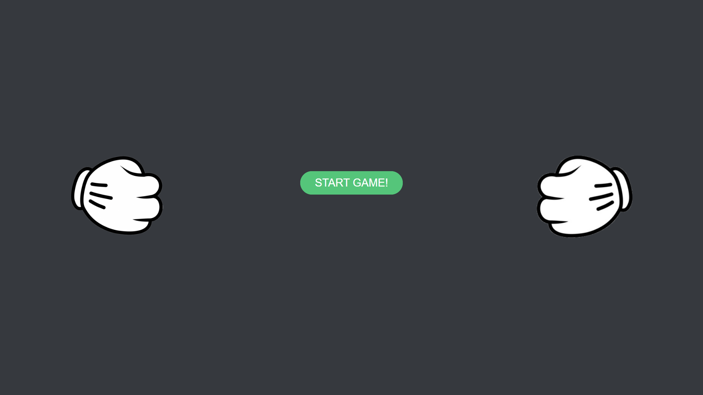
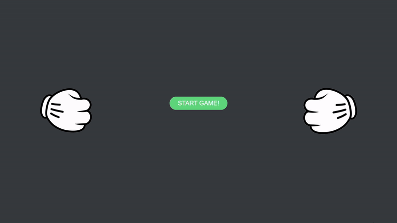

# RockPaperScissors
JS - Game (Rock Paper Scissors)

I created this simple game with Vanilla JavaScript. I also included some smooth animations to further engage the user.

## How to Play
After pressing the "Start Game" button the user will be prompted to enter in their desired choice. After pressing "Ok" the script picks its own random value and checks who won. The user will then be alerted who won!

